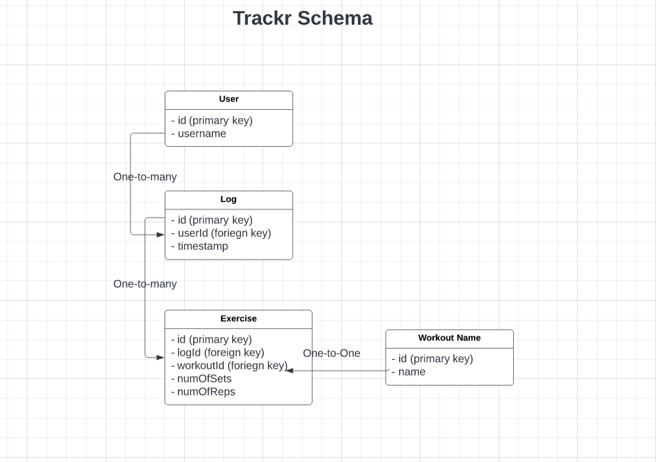

# Trackr
Workout logging application

## Features
- **Home Page**
  - Shows most recent log in card view that is clickable to show more information
  - Shows table of all logs sorted by default by date
    - Clickable rows to show card/modal of more information
- **Logger Page**
  - Add a new log entry
    - Modal/Card view with information to add a log
  - Remove a log entry

## Tech Stack
- **Backend**: Springboot (Java)
- **Frontend**: React, Bootstrap, React Router
- **Database**: Postgres

## Stories
- [x] As a user I would to see my most recent log in the home page
- [x] As a user I would see to see all my logs on the home page sorted by date (desc)
- [ ] As a user I would like the table of all my logs to be paginated, by 10 per page
- `logController`, `LogRepo`
- Pagination class?
- Sort by date jpa-"named query"
- [ ] As a user I would like each row of the table of all my logs to be clickable so I can view more information about that log
- [ ] As a user I would like to be able to add a new entry to my logs
- [ ] As a user I would like to be able to remove an existing log entry

# Database Schema
